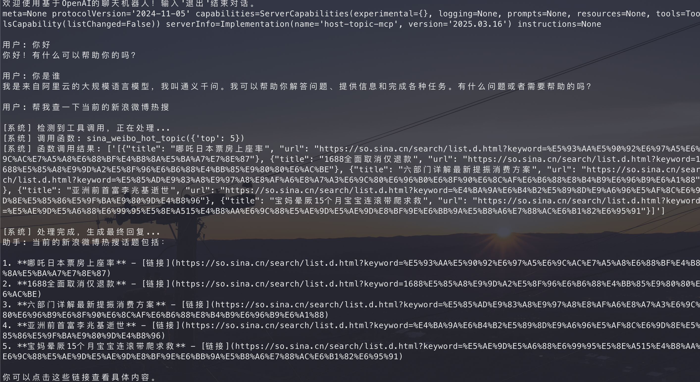
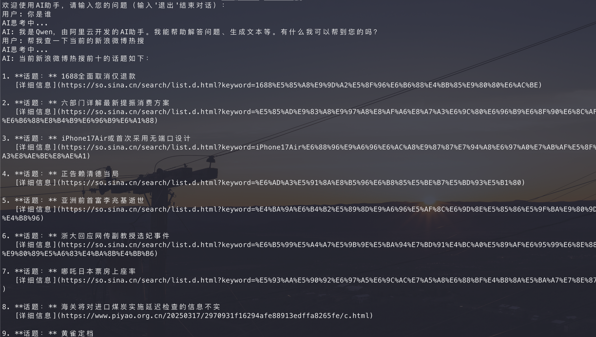

# 项目简介

LLM调用MCP
运行：
```bash
pip install uv

uv sync

uv run xxx.py
```

## 1、基于python-openai模块实现MCP的调用
实现效果



## 2、基于Langchain实现MCP的调用



# 调用原理

## 1、构造LLM工具调用MCP

1、首先将问题和所有的工具都传入LLM中，让LLM选择工具
2、LLM选择工具后，将工具的名称和参数传入MCP执行
3、MCP根据工具的名称和参数调用工具，返回结果
4、再将问题和MCP返回的结果传入LLM中，让LLM给予最终响应

> 有的模型并不支持工具调用，需要注意

## 2、根据提示词调用MCP

1、将所有的MCP的工具和参数都写入系统提示词中
2、让LLM返回需要调用的对应MCP
3、调用MCP返回结果
4、将用户问题+MCP返回的结果传入LLM中，让LLM给予最终响应

> 这种兼容所有的模型，不需要模型支持工具调用

`openai_prompt_invoke.py` 就是模仿该思路调用MCP